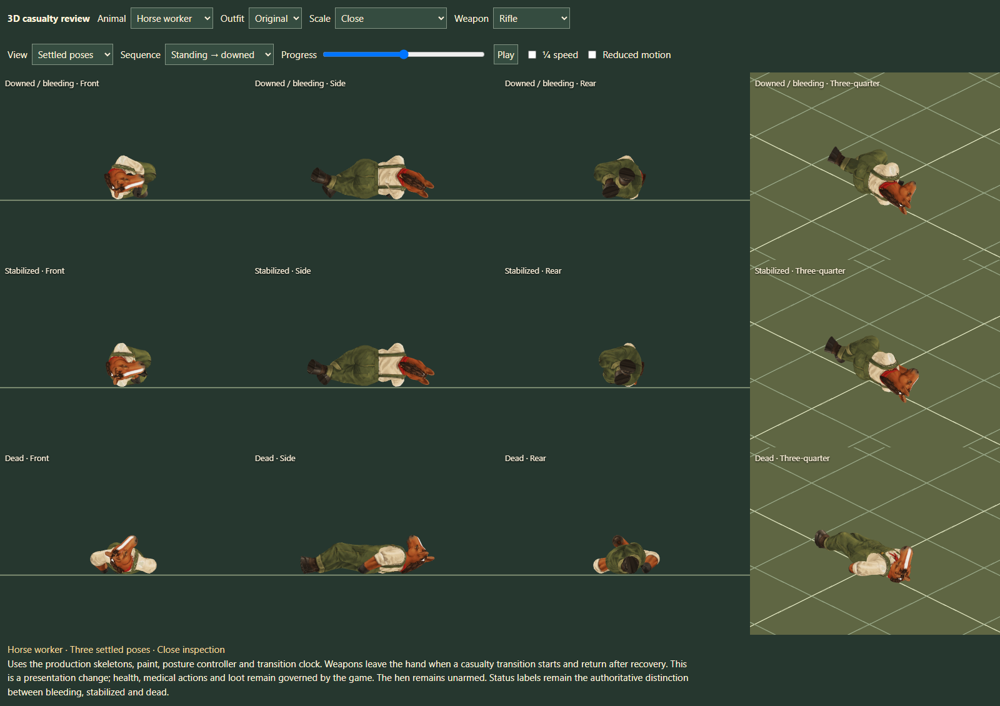
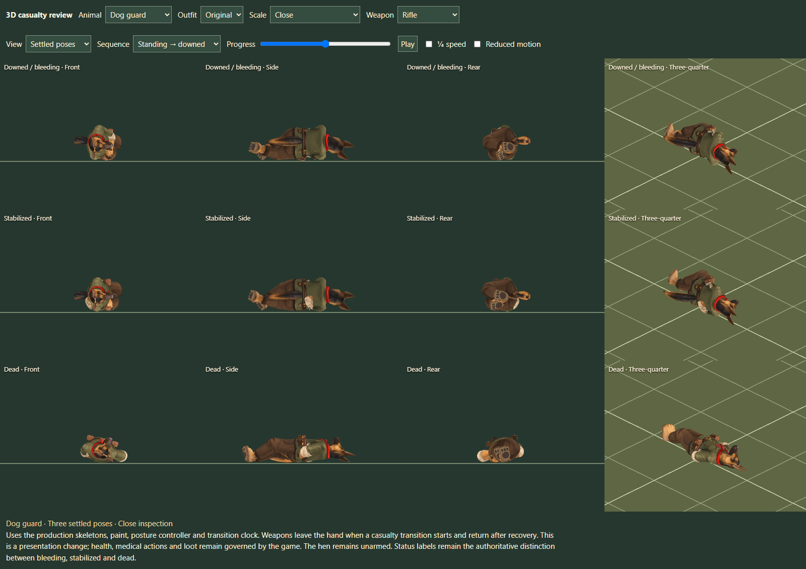
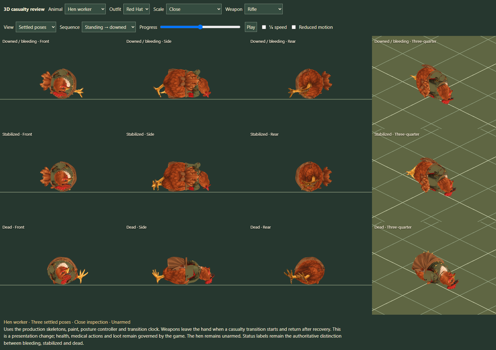
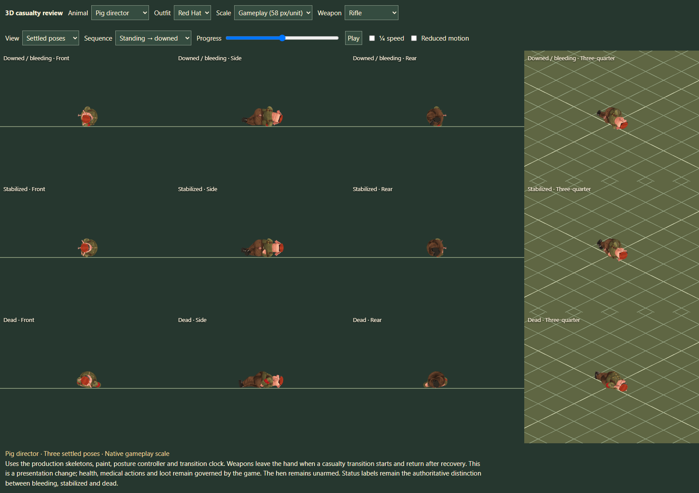

# 3D casualty presentation — architect handoff

22 September 2026. Review branch: `work/casualty-3d`, based on 3D canonical `8e7140f`. **Independent hostile review: 9/10.** This refines the integrated casualty baseline; no simulation or damage rules changed.

Open `tactics/animal-casualty-review.html` from the gallery. The local review server is `http://127.0.0.1:4433/tactics/animal-casualty-review.html`. The same posture controller is used by `battle-3d.html`.

## Delivered

- All twelve approved smaller meshes, original and Red Hat outfits: curled downed/stabilized poses and relaxed, extended dead poses. Preserve the approved dimensions and painted art.
- Cached, species-specific surface support corrections using skeleton rotations, plus reversible tail articulation. Corpses no longer balance above the ground on their tails. The hen uses her actual motion skeleton, wings and feet.
- Standing/kneeling/prone collapse, direct casualty loading, stabilization, death and retained-stance recovery. Endpoint geometry is independent of the first source stance and equipped rifle/HMG.
- Weapons, replacement grasp meshes, flamethrower mount and hose hide during casualty transitions and restore on recovery. No animation-generated loot or inventory changes. Core loot remains authoritative.
- Dog pads and fur-covered rabbit soles now cover surfaces absent from the turnaround painting. Paw geometry is preserved.
- Fixed the director's unreachable HMG carry by lifting the complete weapon six centimetres, retaining both exact grip anchors. Prevented the firing controller from taking over halfway through casualty recovery; hidden HMGs no longer enable grasp-specific forearm paint.

## Verification

- `npm run check`: **724 tests pass**, plus tactical asset validation.
- Focused casualty/posture suite: **53 tests pass**, including 37 new tests. Dense transitions, finite surfaces, floor clearance, torso support, direct-entry history, reduced motion and recovery to each retained stance.
- `npm run build:tactics-3d`: passes; includes the new module and viewer.
- Browser: **48 animal/outfit/scale configurations**, **192 transition strips**, no page/console errors. Four views, close and native 58 px/unit scale. See [browser results](casualty-review/browser-results.json).
- Controlled live renderer fixture: bleeding/stable/dead and prone recovery; actor placement matches `toWorld` at floors 0, 1 and 2. These are renderer-state fixtures, not new damage/medical-event replays.
- All fitted Red Hat caps checked in all three settled states (33 cap checks; foreman's cap is part of the original mesh). See [cap/floor results](casualty-review/caps-and-floors.json).
- Additional equipment check: HMG and flamethrower hiding/restoration pass on all eleven mammals, including grasp meshes, mount and hose.

The reproducible browser harness is `tools/casualty-review.mjs`; set `PLAYWRIGHT_PATH` when Playwright is installed outside the repository. Raw local evidence is under `artifacts/casualty-review/` and is not included wholesale in Git.

## Scope and remaining limits

Recovery is a brief interpolated state transition, **not a fully authored supported get-up**. Bleeding and stabilized retain authoritative status labels. Weapon hiding does not create a physical dropped model. No ragdoll, scenery-aware fall solver, corpse collision change, new medical-event replay or complete 2D body-sprite comparison is claimed. The hen remains unarmed. Publication/architect integration is separate from this review-branch delivery.

## Selected evidence

