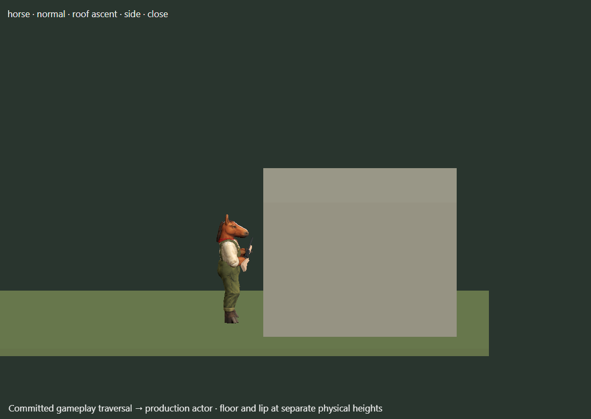
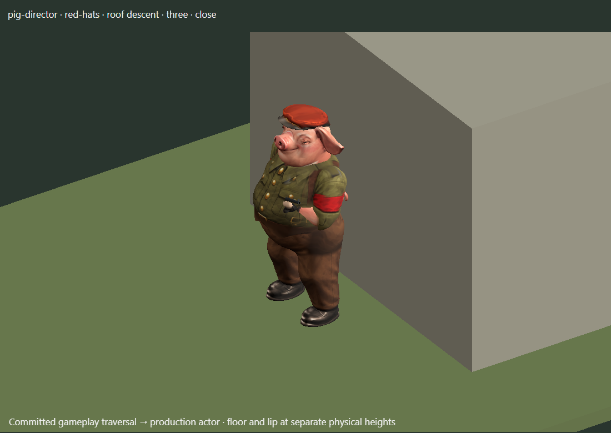
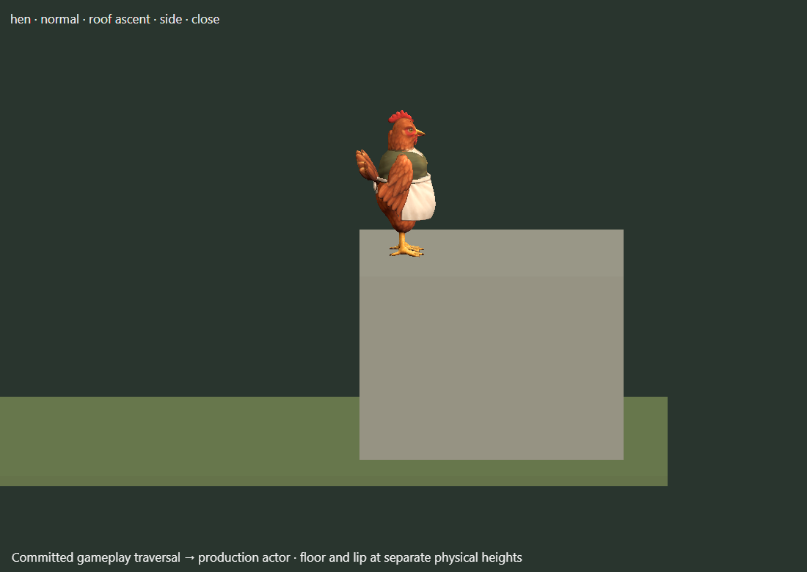

# Roof traversal grounding correction

## Result and scope

Roof ascent and descent now use the physical lower floor and upper roof as separate support planes. The old adapter added the roof slab's 0.12-tile thickness to the entire authored clip, lifting feet off the lower floor. The corrected adapter preserves lower-floor contact, adds the height difference during the unsupported jump, and removes it during the unsupported drop. Native body dimensions, bone lengths, equipment and approved supported poses remain intact.

The same height calculation handles an upper-storey cliff foothold: a character starting on a cliff at height 2.00 and climbing onto a roof at 4.24 has a 2.24-tile rise. The reverse descent uses those exact physical endpoints.

This completes the **roof-height subtask of Stage 1**, not the whole animation physics plan. Ramp grounding remains held. No changes to ordinary locomotion, aiming or the core movement rules are included in this delivery.

## Validation

- `node --test tests/ledge-grounding.test.mjs tests/roof-gameplay-animation.test.mjs tests/ledge-descent-gameplay.test.mjs tests/roof-mantle.test.mjs tests/ledge-descent.test.mjs`: **105 passed**.
- The new contact matrix covers all 12 animals, roof and cliff ascent/descent, native scale, physical soles, supported intervals, forward/reverse scrubbing and phase boundaries. The existing gameplay tests consume committed movement events, check cancellation/restoration, and preserve AP/state.
- A legal mixed cliff-to-upper-roof fixture verifies the 2.00-to-4.24 support heights. Tests distinguish the floor at 0.00 from the roof at 2.12; checking only the final tile center would miss the original defect.
- `npm run build:tactics-3d`: passed, including the published entrypoints' module dependency check. Both new helpers are packaged.
- Fresh browser captures use `BattleRenderer.actor` and `BattleTraversal` after legal core movement. They include horse roof ascent, red-hat pig director roof descent, hen roof ascent and a cliff regression view. The review scene draws the corresponding support surfaces at their actual game heights; it is a diagnostic harness, not a newly integrated gameplay feature.
- Independent hostile review: **9/10 for this roof-height subtask**, with 92 tests independently rerun and the fresh horse, hen and director frames inspected. This overlaps the 105-test run above; the counts are not additive. The reviewer did not claim to watch the recorded video. The Stage 1 completion gate remains open.

The broad `npm run check` run completed 1,635 tests with 1,633 passes and two failures, while the ramp experiment was still present. Those failures were an obsolete wooden-ramp catalog assumption and missing base Pages dependencies. Both failed test files now pass all four tests after correction. The subsequent asset check also exposed procedural wood-plank/trellis assets incorrectly treated as missing PNGs; it now validates their actual generated material/geometry and passes. The final 105-test roof run and build pass on the reduced delivery scope. No second full-suite pass is claimed.

The small validation/package repairs add `bridge-trellis.js` and `combat-state.js` to the base Pages distribution, retain real timber geometry checks, and distinguish procedural materials from raster assets. They do not rebuild ramps or alter collision behavior.

## Rendered evidence

## Remaining holds

- **Ramps:** the experimental pass improved straight uphill/downhill contact, but starting a climb while turning still changed swing endpoints abruptly. The experiment was removed from runtime changes and preserved locally with source, tests and review probes. Resume with stable support planning through turns and gait blend changes; do not approve based only on straight walks.
- **Traversal transitions:** existing horizontal entry/exit foot sliding remains Stage 2. This correction fixes vertical support, not those frozen-pose translations.
- **Impact and recovery:** the existing landing compression timing remains Stage 5. Other gait, equipment, crawl and casualty-recovery findings retain their checklist status.

## Baseline and delivery

Work began in an isolated worktree from `8dc3604`, on `work/animation-grounding`. Changes since the original review's `ef6bb7b` affect the helicoid shot study, not the reviewed animation controllers. The main checkout and the other agent's work were left untouched.

Delivery branch: `work/animation-grounding`. The Pages workflow deploys `main`; pushing this work branch does not publish the correction to the live game. The separate [hostile review record](hybrid-review/roof-grounding/ROOF-HEIGHT-HOSTILE-REVIEW.md) records the scoped score and remaining holds.

The local evidence and held experiment are preserved under `artifacts/grounding-2026-10-03/` in the worktree. Browser and temporary-server lifecycle records live there too. The actionable checklist remains `AnimalFactory3D/plans/ANIMATION-PHYSICS-ACTION-PLAN.md` in the shared workspace.
