# Strategic sites — intact and destroyed

Three custom sites, each occupying **8 × 8 tiles including all wreckage**. The
painted reference boards and shared material atlas are authored for these assets.
Each site has a complete intact form and a persistent destroyed form.
The user permits a larger footprint where the design needs it. These three
layouts retain usable approaches within 8 × 8; their placement footprint is
**not** a solid collision block.

This document records the **art library and comparison study**. The editor and
live combat integration is described in [STRATEGIC-SITES-GAMEPLAY-HANDOFF.md](STRATEGIC-SITES-GAMEPLAY-HANDOFF.md).
Strategic effects still await campaign work. The two states are static models;
there is no authored collapse animation.

The review entries below preserve the art branch's chronology. Their references
to integration pending describe the pre-integration review; the gameplay handoff
above is the current status.

## Review checklist

- [x] Painted intact/destroyed reference board for each site.
- [x] Shared painted skins, with geometry concentrated on silhouettes.
- [x] Six reusable 3D forms at native game scale.
- [x] 8 × 8 footprint, including debris, verified after quarter-turn rotations.
- [x] Each loose wreck assembly independently contacts the slab.
- [x] Shared foundation and equipment positions retained between states.
- [x] Side, rear, overhead and three-quarter review; gameplay scale comparison.
- [x] Focused geometry, resource ownership and browser checks.
- [x] Pages build includes viewer, models, materials and reference images.
- [x] Independent hostile review: **9/10**, 2026-10-06, no blocking findings.
- [x] Follow-up: enlarge undersized hut doors and check native character scale.
- [x] Follow-up: give the radar hut a clear front approach in both states.
- [x] Follow-up: export separate standing passage maps for each damage state.
- [x] Follow-up: lock the camera when comparing damage states in place.
- [x] Follow-up: verify every permanent concrete vertex is identical in both states.
- [x] Independent hostile review of the scale/passage follow-up: **9/10**.
- [x] Replace full-height square probes with measured circular height bands.
- [x] Reopen false-positive concrete cells without shrinking the characters.
- [x] Show the selected turning envelope and real geometry contact on inspection.
- [x] Independent hostile review of the rounded-clearance correction: **9/10**.
- [x] Center the radio service hut and upper-right cabinet on tile anchors in both states.
- [x] Independent hostile review of the radio placement correction: **9/10**.
- [x] Correct the radio hut to the center of a **2 × 2 tile block**, not one tile.
- [x] Verify its complete geometry occupies four cells and adjacent horse positions stay usable.
- [x] Independent hostile review of the 2 × 2 footprint correction: **9/10**.
- [x] Apply the same 2 × 2 footprint alignment to the radar hut; independent review **9/10**.

## Assets and visual intent

| ID | Intact silhouette | Destroyed silhouette |
| --- | --- | --- |
| radio | Tall red/ivory open lattice mast, two microwave dishes, aerials, service hut | Two fallen striped lattice sections, snapped stubs, detached dish, scorched equipment |
| radar | Broad concave segmented dish and feed, red yoke, open trestle and maintenance deck | Reflector with a missing sector, buckled supports, fallen deck, detached dish sector |
| sam | Twin ivory missiles with red nose caps, elevated rails, trunnion and lifting ram | Bent rails, broken charred fuselage, detached nose, damaged turntable and controls |

The concrete hardstanding gives each site a complete base. The 2 × 2 concrete
panels are a visual treatment, not a change to the 1 × 1 game tile size. The
viewer's optional grid shows all 64 individual tiles.

The radio mast is about 9.67 units tall, the radar tower 8.10, and the SAM site
3.19. A normal wall remains 2 units high. Each model is approximately 4,000–9,600
triangles (the radar is 9,636). Exact counts and bounds are generated into the asset manifest.
The horse retains its original 1.65-unit height. Both service huts now have
1.85 × 1.10-unit door openings; their original doors were too short.

The radio hut now centers at local X/Z **[-3, 2]**, in the middle of columns
**1–2, rows 6–7**. Its complete geometry fits the four-cell area X[-4,-2], Z[1,3],
including the roof and damaged door. The existing hut size is retained. The
one-tile cabinet remains at **[2.5, -2.5]** (column 7, row 2). Even-sized buildings
must be centered between their occupied cells; centering this hut on a single
cell made it straddle a 3 × 3 area.

Foundations move with the hut, and the cable follows it while retaining the
tower attachment. Both damage states use the same placement. The damaged door
is inset 0.01 to keep its swung corner inside its plinth; this shared detail also
corrects the radar hut. Native scale and tower/wreck geometry are unchanged.
All six in-site wall-adjacent cells admit the horse, with tested movement along
each wall. Both side-wall cells also permit whole-roster turning.

The radar hut follows the same **[-3, 2]** center and four occupied cells. Its
existing 1.5 × 1.5 wall body is retained; complete geometry fits X[-3.862,-2.138],
Z[1.15,2.85]. All six adjacent horse positions and three wall-parallel movements
are clear in both states. Its tower, cabinet and fallen equipment are unchanged.

Materials use broad hand-painted wear, cream highlights, olive/red industrial
paint and charcoal scorch. Generated raster sources are preserved unmodified;
the meshes map into bounded regions of one eight-material atlas.

## Files and local use

- Viewer: `dist/tactics/strategic-sites-study.html`
- Library: `dist/tactics/strategic-sites.js`
- Standing clearance analysis: `dist/tactics/strategic-site-clearance.js`
- Asset manifest: `dist/assets/environment/strategic-sites/manifest.json`
- Painted files: `dist/assets/environment/strategic-sites/*.png`
- Image prompts/provenance: `docs/tactics/strategic-sites-image-prompts.json`

Start the read-only preview with:

```powershell
node tools/serve-strategic-sites.mjs 4475
```

Open `http://127.0.0.1:4475/tactics/strategic-sites-study.html?site=radio&mode=pair`.
Select `radio`, `radar` or `sam`; show both states or inspect one. View choices
include side/rear/overhead. Gameplay scale is exactly 58 CSS pixels per tile.
The horse is a scale reference and is not part of the asset footprint. Choose
**Ground & player** framing to inspect a full-height horse beside the hut at close
scale. The ruler is exactly two tiles tall (a normal wall) and hides in overhead
views or below 30 px/tile, where its labels would overlap.

**Passage map** displays individual 1 × 1 cells: green for reachable turning space,
red for restricted turning space, amber for a clear but disconnected pocket. The connecting
lines represent tested cardinal sweeps. Click any cell to inspect its body outline
and, if blocked, the actual point of contact with the site. The outline represents
room to turn at every heading: the whole-roster option also accommodates broader
bodies and the skunk's tail. **Body outline** hides these inspection lines.
This is not an occupied-footprint or gameplay-cover map. A red whole-roster cell
may fit an individual character facing a particular way, but cannot guarantee
every species can turn freely there. Use **Horse** for the visible character.
The radio hut occupies four cells even when a larger turning envelope excludes
additional neighboring centers; those exclusions must not become extra solid
building tiles in the gameplay catalog.

Click a clear cell, or use **Horse tile**,
to place the horse on the slab without resizing it. In the paired view the chosen
tile must be clear in both states. Changing state/profile moves an invalid old
placement to a clear tile and reports the change.

**Compare in place** switches from the pair to a single site; **Toggle damage**
then swaps its state at the same origin. Framing always uses the union of both
states, and state changes retain orbit and zoom. Changing the player tile does
not reframe the site. **Fixed foundations** outlines the actual concrete bases,
including the SAM's round base. Scattered fragments have irregular wedge shapes
to distinguish them from the permanent footings.

The server shuts itself down after 24 hours or when its private
`artifacts/strategic-sites/STOP` file appears. A deliberate restart must remove
that marker first and register the new process lifetime with helper-lifecycle.

## Library contract

```js
const atlas = await new THREE.TextureLoader().loadAsync(STRATEGIC_SITE_ATLAS);
const library = createStrategicSiteLibrary(atlas);
const {root} = library.build('radio', {state: 'destroyed'});
scene.add(root);
const passage = library.clearance('radio', {state: 'destroyed', profile: 'wide'});
// Move/rotate each root independently; roots share library-owned resources.
// After removing every borrowed root:
library.dispose();
atlas.dispose(); // Caller owns the input atlas.
```

The local anchor is the center of the footprint at ground height:
`[0, 0, 0]`, Y up, X/Z in `[-4, 4]`. The top of the slab is Y=0.24.
Quarter-turn rotations preserve the footprint. Build never disposes another
root's resources. Library disposal is idempotent; building afterward throws.

Whole-site roots can be swapped at the same transform for a persistent wreck.
They contain named semantic assemblies such as `fallen-reflector` and
`fallen-mast-lower`; individual meshes inside those assemblies are batched by
material. The pack is currently procedural Three.js source, not a rigged GLB.

## Passage proposal and integration contract

`library.clearance(id, {state, profile})` returns an independent copy of cached
clearance data. The manifest contains the same masks, connections and entries
for all six forms. `root.userData.foundations` records unchanged local bounds
and convex X/Z outlines for each permanent concrete foundation.

- Version 3 uses **circular height bands**, measured from actual neutral triangle
  cross-sections of all twelve native meshes. Add 0.02 radial clearance and round
  upward to 0.01. The horse is 1.70 high including margin; the roster envelope is
  1.85 high. Neither character dimensions nor site geometry are changed.
- The earlier square probe incorrectly used maximum tail/shoulder width all the
  way down to the ground. It blocked visibly empty diagonal corners and concrete
  beside low footings. The new foot radii are 0.35 for the horse and 0.38 for the
  roster, with wider radii only where the actual bodies require them.
- The standing probe starts at slab height + 0.08, allowing low cable covers and
  tiny fragments below that height. Foundations, equipment, braces and larger
  rubble intersecting the body/head envelope block the cell. Elevated parts
  above headroom do not automatically block the ground beneath them.
- Rows run from local Z = -3.5 to +3.5; columns run from X = -3.5 to +3.5.
  Cell indices are zero-based. Add the local cell origin, then the placed site's
  translation/rotation, to obtain world cell centers. If the editor anchors at
  the first cell instead, use the recorded `[3.5, 3.5]` placement-origin offset.
- `.` is reachable clear space, `#` is blocked, and `o` is an isolated clear
  pocket. Connections test **continuous capsule sweeps** for every circular height
  band between adjacent centers. Site triangles are clipped to each band's height;
  the projected polygons are checked against the swept circle, not its bounding
  rectangle. Boundary entries also test the sweep to the neighboring outside cell.
  Clear centers alone do not establish a path. Diagonals are not defined.
- Slab support height is **0.24**. The art-level outside-entry test assumes this
  height throughout its sweep; the game must resolve the transition from local
  terrain onto the slab using its own step/ramp rules.
- These are **neutral standing and turning fit proposals**, not game navigation, projectile
  collision or cover data. Held weapons, animation extremes, adjacent props,
  climbing, line of sight and roof access require separate integration checks.

| Height above slab | Horse radius | Whole-roster radius |
| --- | ---: | ---: |
| 0–0.25 | 0.35 | 0.38 |
| 0.25–0.50 | 0.34 | 0.43 |
| 0.50–0.75 | 0.44 | 0.55 |
| 0.75–1.00 | 0.46 | 0.67 |
| 1.00–1.25 | 0.46 | 0.70 |
| 1.25–1.50 | 0.30 | 0.72 |
| 1.50–profile height | 0.19 | 0.71 |

| Site/state | Horse reachable tiles | Whole-roster reachable tiles |
| --- | ---: | ---: |
| Radio intact | 50 | 42 |
| Radio destroyed | 38 | 28 |
| Radar intact | 47 | 42 |
| Radar destroyed | 40 | 37 |
| SAM intact | 40 | 36 |
| SAM destroyed | 35 | 33 |

For the whole roster, the SAM correction restores 15 intact and 16 destroyed
tiles that the square probe incorrectly blocked. Raised equipment and genuinely
intersecting wreckage still block their cells. Contact markers are reconstructed
on the actual source triangles, including sloping wreckage, rather than placed
at an approximate height-band midpoint.

Open concrete therefore stays usable; destruction updates its routes to account
for the fallen equipment. A placement system must reserve the full site footprint
without marking every reserved tile impassable.

## Checks

```powershell
node tools/export-strategic-sites.mjs
node --test tests/strategic-sites.test.mjs tests/strategic-site-clearance.test.mjs
npm run build:tactics-3d
# Use an installed Playwright dependency; this creates and closes a temporary Edge.
$env:PLAYWRIGHT_PATH = 'PATH/TO/node_modules/playwright'
node tools/check-strategic-sites.mjs
```

The twenty-five focused tests cover all six forms and all four quarter turns,
per-assembly ground contact, retained foundations, finite geometry and bounded
UVs, clone independence, repeat construction, single disposal, radar platform
clearance and the manifest. Additional checks compare exact permanent concrete
vertices, all twelve native character envelopes, door approaches, overhead
clearance, thin barriers between clear cells, isolated pockets, placed/rotated
masks and exported navigation proposals. Rounded-clearance regressions check
triangle cross-sections through band boundaries, low versus shoulder-height
obstacles, diagonal corners, capsule sweeps past endpoints, the formerly blocked
SAM perimeter, genuine central obstructions and on-surface contact markers.
Both hut-footprint regressions include all hut geometry, retain the model sizes,
require exactly four occupied cells and test the six adjacent horse positions
plus three continuous wall-parallel movements in both damage states.
The browser check covers 24 model/view combinations, 18 in-place damage swaps
across scale/framing controls after orbiting and zooming, six passage/profile
comparisons, on-slab native player placement, rendered mask parity, the body/contact
inspector, controls,
repeated selection, a narrow viewport and disposal.
Screenshots and helper close receipts go to ignored `artifacts/strategic-sites/`.

## Gameplay integration checklist (updated 2026-10-07)

- [x] Register both states for all three sites in the **shared 3D prop catalog**.
- [x] Define editor placement/rotation and 8 × 8 reserved footprint separately
      from movement occupancy.
- [x] Consume the authored per-state passage proposal and verify it against game
      navigation, slab entry heights, standing/turning envelopes and adjacent props.
- [ ] Review every armed animation pose in the passages; the conservative standing
      mask does not guarantee that every moving weapon or limb clears the geometry.
- [x] Define collision/cover/visibility geometry separately for intact and
      destroyed states; do not treat the full bounding box as a solid.
- [x] Connect game damage events to persistent state changes and save/load.
- [ ] Define any radio, radar or SAM strategic behavior independently of the art.
- [x] Exercise editor save → load → playtest with all six variants.

Do not register these only in an older editor catalog. Previous large-tree work
showed that the current 3D editor and game must agree on their shared prop types.

## Hostile review result — 2026-10-06

### Radar 2 × 2 footprint correction

Independent scoped review: **9/10 — pass**, with no blocking findings. The radar
hut now centers at [-3,2] and occupies only columns 1–2, rows 6–7 in both states.
Fresh overhead and front/back/side close views confirm all six neighboring horse
positions, with actual skin bounds at least 0.2327 tile from the hut. All three
wall-parallel routes remain clear. Foundations match across damage states and
custom orbit/zoom remains fixed when comparing in place.

All **25** focused tests and the browser matrix pass, including close native-horse
placement beside both huts in both states. The Pages build and all ten packaged
file comparisons pass. Main tower scale and wreck geometry are unchanged. Review
browsers closed successfully and exact recorded identities were verified absent.
Gameplay cover behavior remains separate integration work.

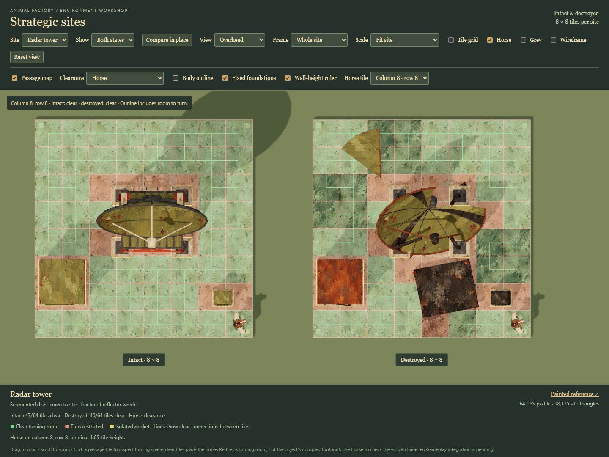
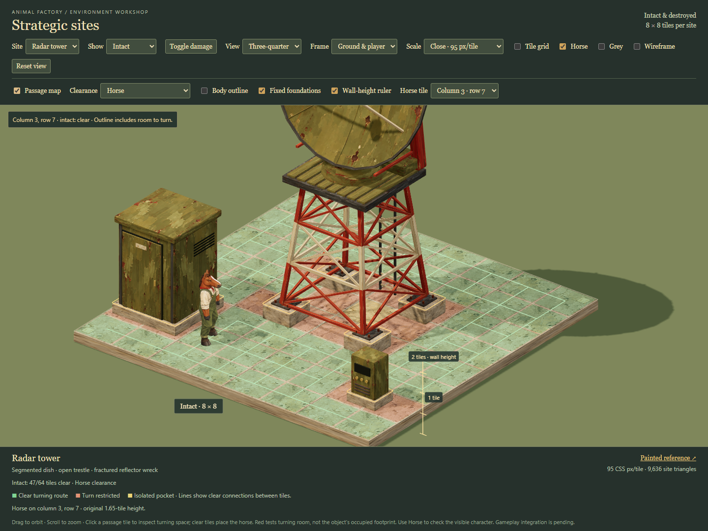
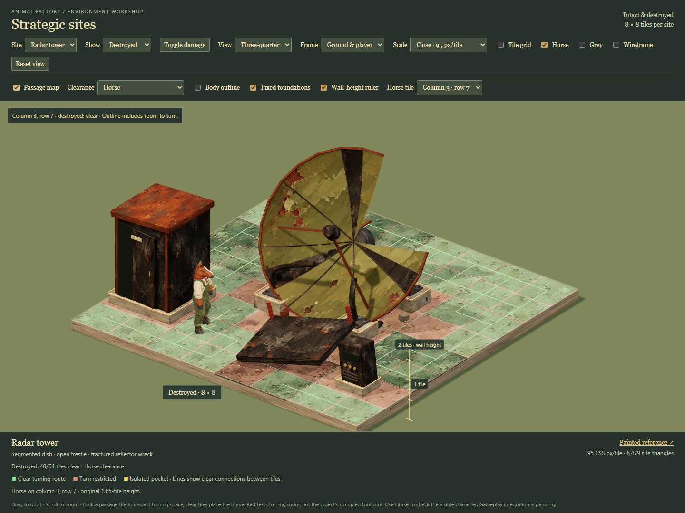

### Radio 2 × 2 footprint correction

The prior single-tile anchor review missed the even-sized building requirement.
The hut is now centered between four cells, with its cable and unchanged concrete
foundation following the corrected placement. All six in-site neighboring horse
positions and their wall-parallel movements remain clear. The side-wall pair also
admits the full roster's turning envelope. Broader front/back turning restrictions
are labeled as turning clearance, not additional occupied building tiles.

All **24** focused tests and the browser matrix pass. Fresh native-horse close
views exercise a wall-adjacent position in both states; the Pages build passes.
Independent scoped review: **9/10 — pass**, with no blocking findings. Every hut
vertex is within X[-3.862,-2.138], Z[1,3] in both states. Fresh front/back/side
views confirm the actual horse skin clears the hut by at least 0.0827 tile at
each of the six neighboring positions. Foundation records and custom-orbit
damage comparisons match exactly. All ten packaged files match source, and
temporary browser processes closed and were verified absent. Approval covers
the asset layout and proposed clearance; implemented gameplay cover remains
separate integration work.

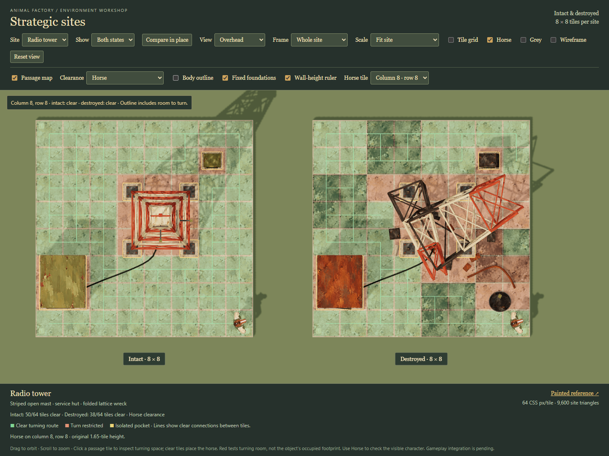
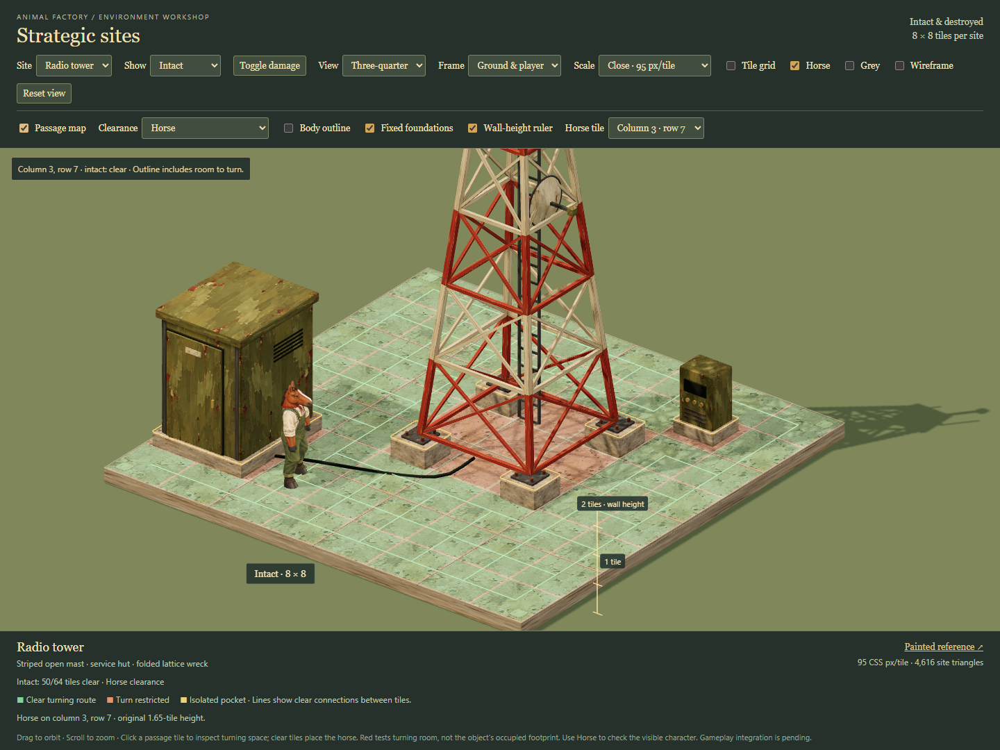
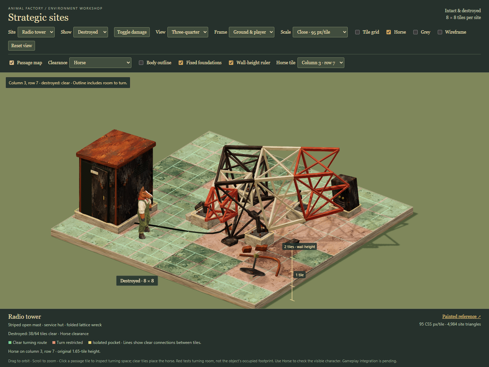

### Radio tile-center placement

Historical record: the hut's single-cell centering was incorrect for its 2 × 2
size and is superseded by the footprint correction above. The cabinet remains centered.

The service hut and upper-right cabinet now sit on half-integer tile centers.
Regenerated passage maps give the horse 45 intact / 33 destroyed reachable
tiles, and the whole roster 41 / 28. The doorway approach stays usable; all
permanent concrete remains identical between the two damage states.

All **23** existing focused tests and the browser matrix pass, including native
player scale, passage maps and camera-preserving state changes. The Pages build
passes. Independent scoped review: **9/10 — pass**, with no blocking findings.
Fresh overhead and native-player close views confirm both placements. All 1,656
permanent radio concrete vertices match across damage states, and orbit/zoom and
screen projections remain fixed when damage is toggled. The rear cabinet approach
is clear in both states; nearby destroyed-state exclusions are actual fallen
mast beams. All ten packaged files match source. Temporary browser processes
closed successfully and their exact recorded identities are absent.

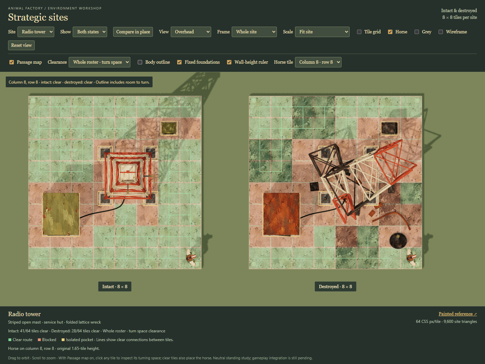
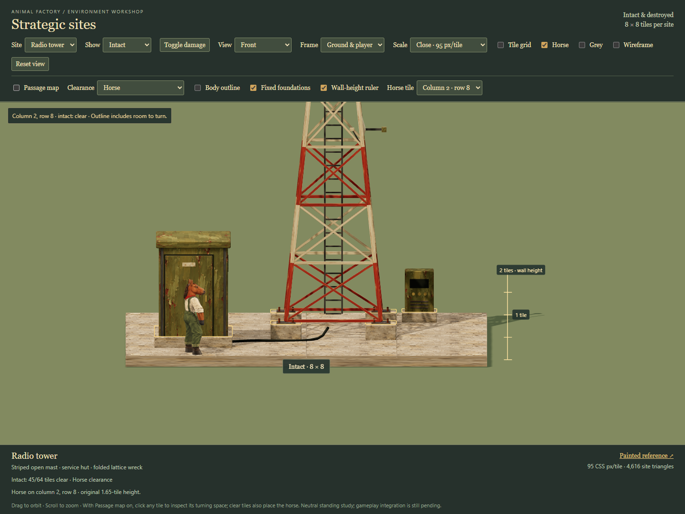

### Rounded-clearance correction

Independent reviewer: **9/10 — pass**, with no blocking findings. All **23**
focused tests pass. The reviewer placed the native horse on eight newly open
SAM samples, inspected close rear views and all three overhead passage pairs,
and checked genuine rail/wreck obstructions and the mobile inspector.

The whole-roster SAM proposal now has **36 intact / 33 destroyed reachable
tiles**, restoring 15 / 16 false positives. A remaining intact rail exclusion
was verified against an actual native skunk-tail vertex at a turning heading;
the horse correctly fits that same tile under its own profile. Character and
site geometry are unchanged.

The builder's browser matrix passes, including the new body/contact inspection.
The reviewer also confirmed pointer inspection and stable GPU resources across
64 successive inspections. Build/module closure and the release asset audit
pass; all **10** packaged files match their sources. Temporary browsers closed
successfully and exact recorded process identities are absent.

This approves the revised viewer and **neutral standing/turning passage
proposal**. Gameplay navigation, animated/armed clearance and slab entry remain
integration work, as listed above.


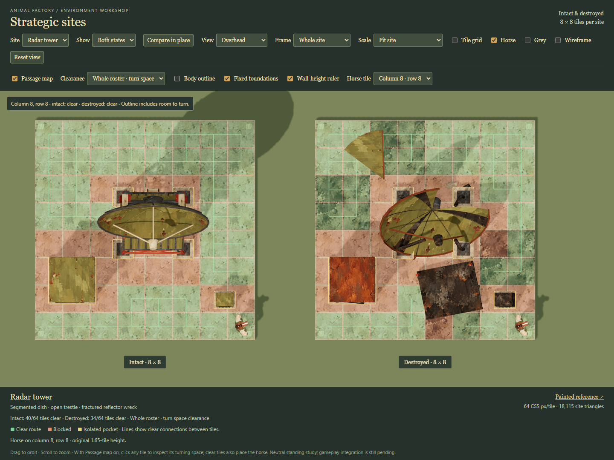
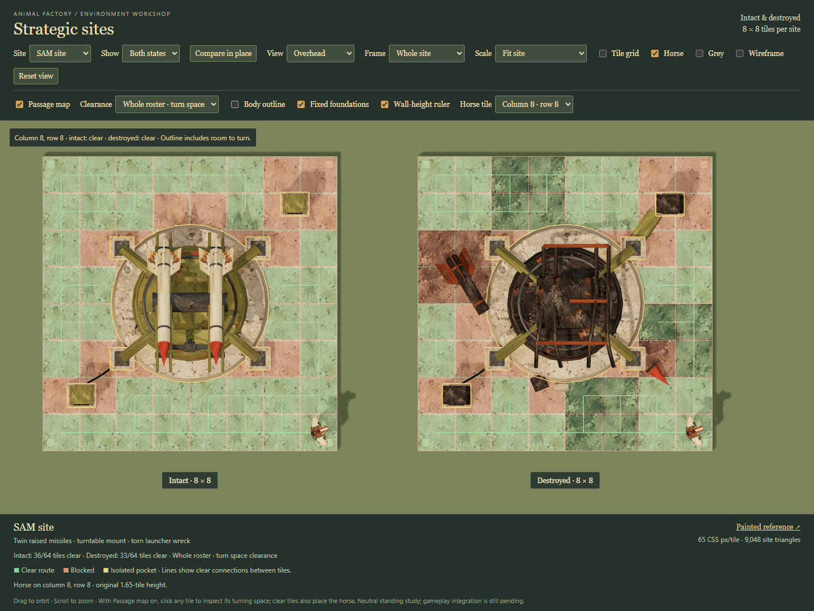
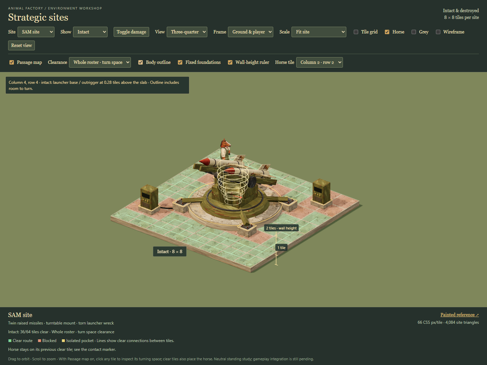

### Scale, passage and fixed-foundation revision

Historical review of the preceding square-probe version; its passage counts and
envelopes are superseded by the rounded-clearance correction above.

Independent reviewer: **9/10 — pass**, with no remaining blocking findings.
All 18 focused tests pass. Independent polygon clipping agrees with all **768**
tile classifications (six forms × two body envelopes × 64 cells) and every
recorded swept connection/outside entry. All twelve native neutral bodies fit
the stated envelopes; the largest measured radial extent is the skunk at 0.699977
and the tallest is the donkey at 1.76194.

Fresh close front/rear/three-quarter and six passage views passed. The reviewer
also checked 12 manually orbited/zoomed in-place comparisons across both framing
modes, confirming identical camera projection after damage, and verified the
mobile ruler fix. The builder's browser suite passed 24 model/view combinations,
18 in-place scale/framing comparisons, all six passage/profile pairs, actual
pointer placement and native horse support on the slab.

Build/module closure pass and all **10** packaged files match source. Temporary
review browsers closed successfully and their recorded processes are absent.
This approves the revised **art, viewer and proposed neutral-standing passage
data**; gameplay integration remains on the checklist above.

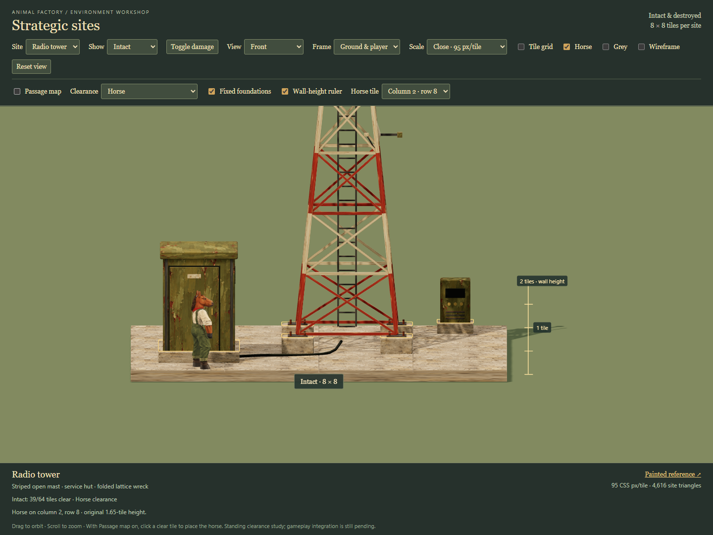
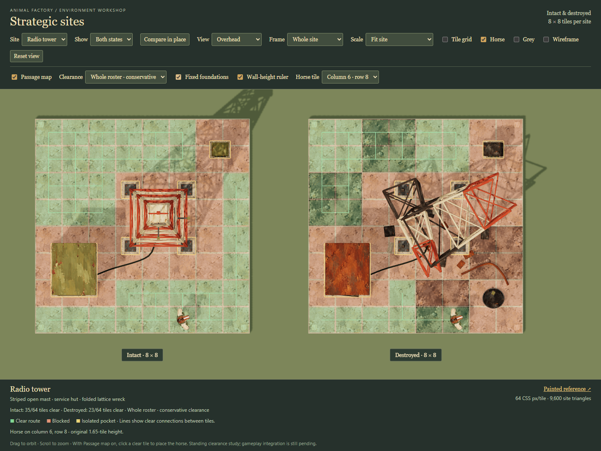
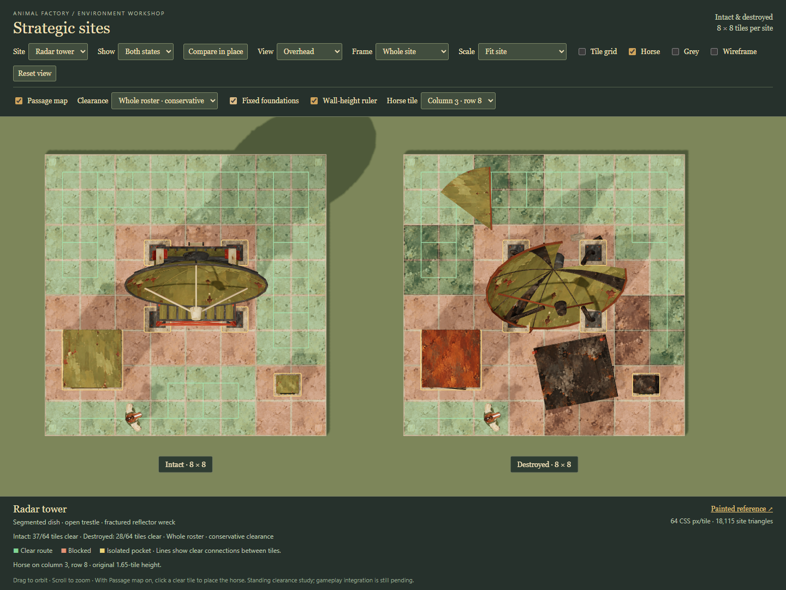
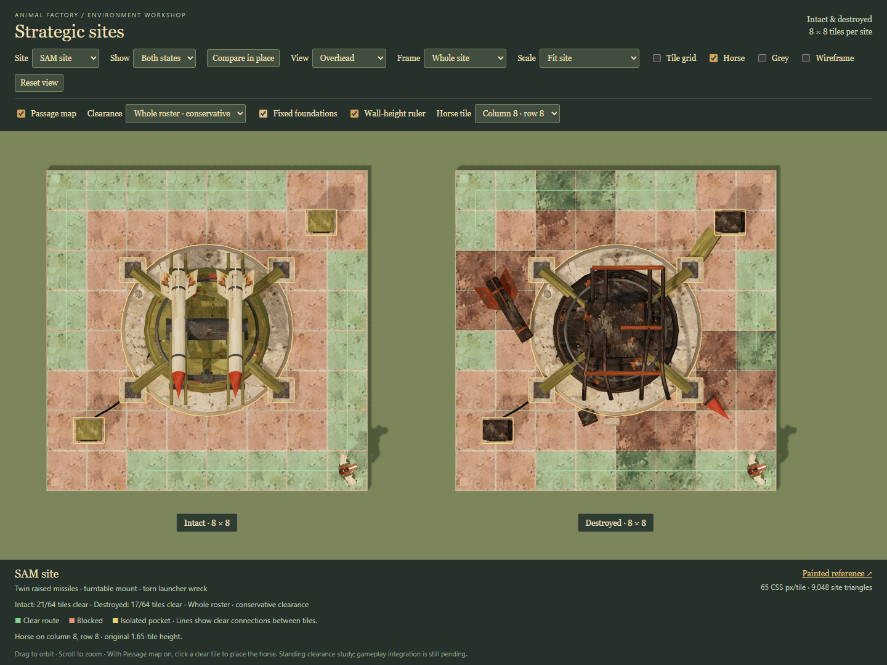

### Original art delivery

Independent reviewer: **9/10 — pass for six presentation assets and viewer**.
Reviewed close and gameplay scales, side/rear/overhead angles, footprint and
ground contact, painted readability, resource ownership and packaged files.
The SAM crossbeam connection, radar platform clearance and rear mount, and
the paired horse references were corrected during review.

All nine focused tests passed independently. Browser checks covered 36 initial
configurations and targeted fresh renders after corrections, plus repeated
selection, controls, mobile fitting and disposal. The builder's repeatable browser
script also passed its 24 model/view combinations on the final implementation.
The build and module closure passed; all nine packaged asset/viewer files matched
their source files. Temporary review browsers exited and their recorded PIDs were
verified absent.

The approval covers **static art and the viewer**. The gameplay checklist above
remains open.

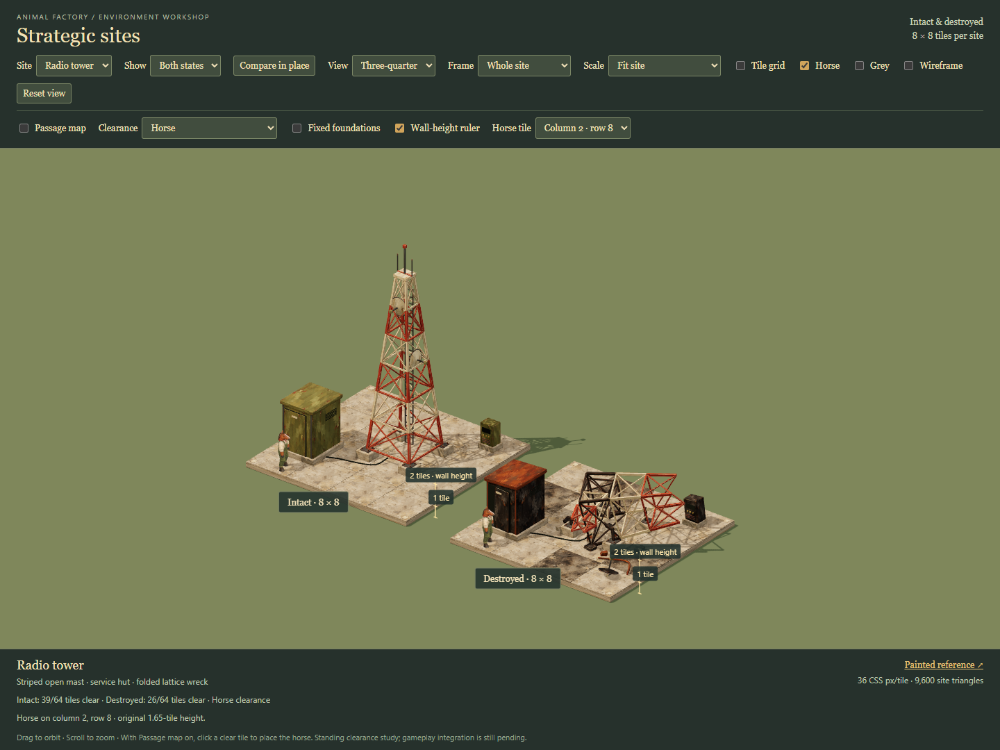
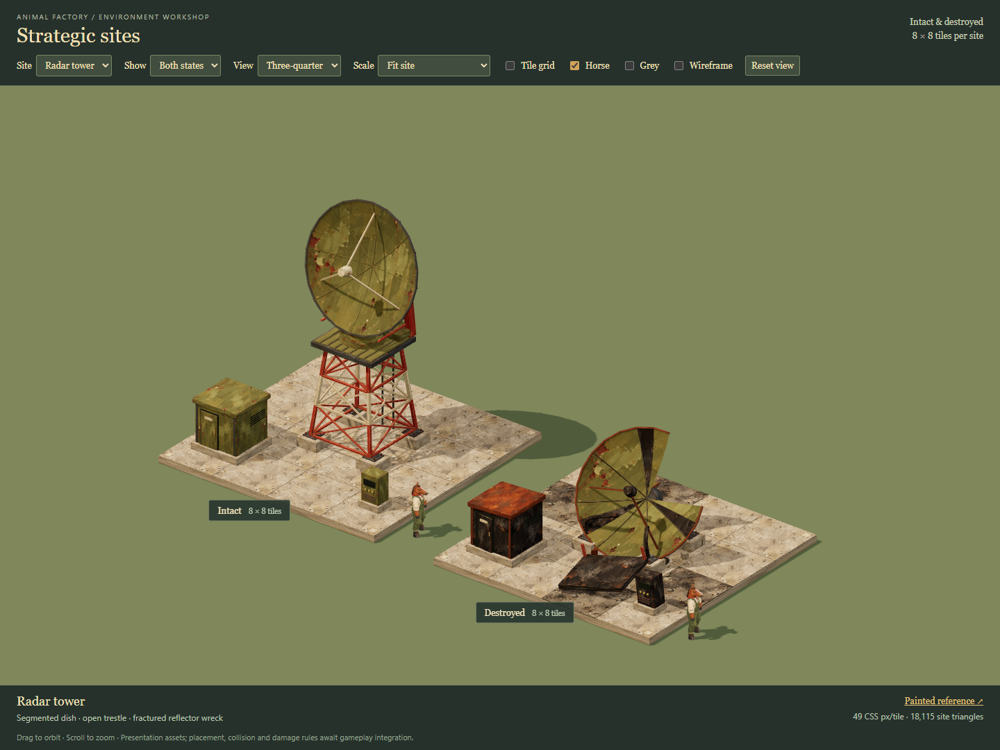
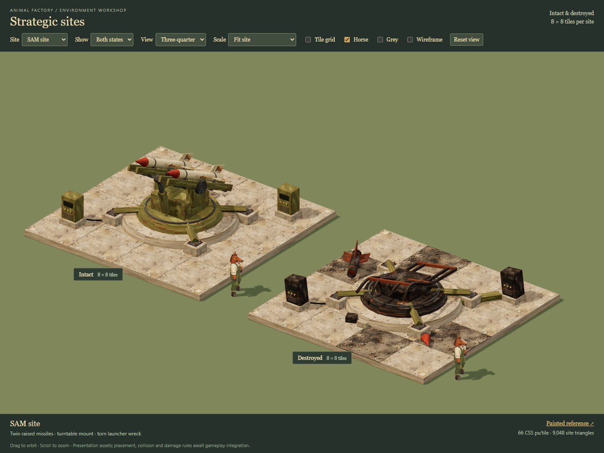
