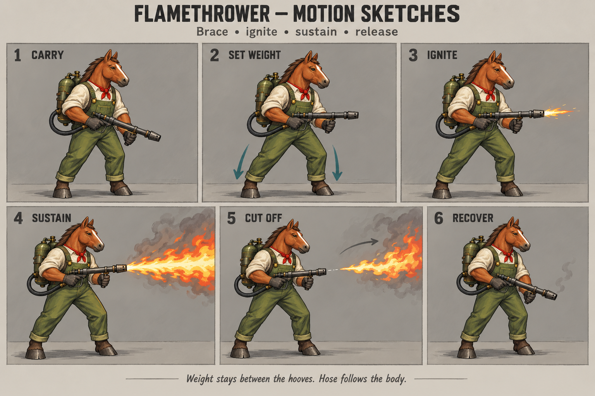
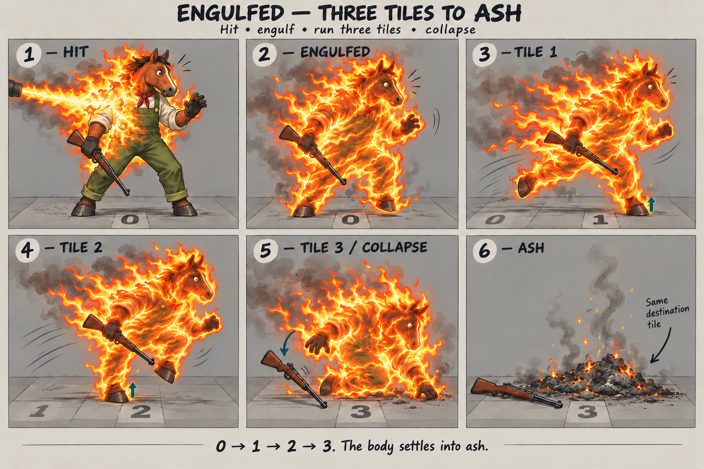

# Flamethrower and on-fire motion storyboards

October 4, 2026. Visual development for the 3D presentation, using the approved horse and existing flamethrower as the first fitting subject. These sheets propose poses and effect behavior; they do not implement or approve game integration.

## Direction

- Keep the horse's approved proportions, exposed hooves, cream shirt, olive overalls and red scarf.
- Keep the existing separate projector, twin tanks, hose and hand grips. The tank mass follows the torso; the hose has slack and follows with a small delay.
- The shooter plants support before firing. A sustained jet gets modest bracing and vibration; it does not borrow the rifle's repeated recoil kicks.
- **User correction: a direct flamethrower hit wraps the entire character in fire, described as being “mummified by the fire.”** The revised hit sheet must show full-body engulfment, rather than separate small clothing fires.
- **User follow-up: keep the movement, travel about three tiles, then turn the body into a pile of ash.** The retained sheet depicts that terminal sequence. It supersedes the initial nonterminal burning-loop sketch.
- Maintain a readable body silhouette and ground contact inside the fire. Use painted cream, yellow, ochre, orange and red shapes consistent with the character art, with warm grey smoke rising. No injury detail is needed.

## Firing sequence

The six drawings are key poses, not equally spaced animation frames. Suggested first study duration: about 1.6 seconds including raising and recovering the weapon. The timings below are presentation proposals, not changes to combat rules.

| Beat | Proposed time | Action and support |
| --- | --- | --- |
| Carry | 0.00 | Both hands maintain their real grips; the projector rests ahead of the body in low ready. |
| Set weight | 0.00–0.30 | Knees soften and hips settle between the staggered feet. If the stance must widen, actually lift and replace a hoof before loading it; do not slide planted hooves apart. |
| Ignite | 0.30 | The flame starts at the actual nozzle transform and travels along its axis. Hand contact and the backpack attachment remain continuous. |
| Sustain | 0.30–0.95 | Feet remain planted; shoulders and elbows hold a modest sustained load. The coherent narrow jet develops into a broader rising plume farther from the nozzle. |
| Cut off | 0.95–1.15 | New emission stops first. The last emitted flame continues forward, leaving a growing gap from the muzzle. Keep the weapon aligned while that tail departs. |
| Recover | 1.15–1.60 | Ease back into carry. The hose follows the torso without crossing knees or the muzzle. |

Use the old 2D palette and cutoff principle as references, not its exact sprite offsets or screen-space path bending. The 3D effect must originate at the model's nozzle and respect the authoritative impact, obstruction and visibility data. A controlled sweep would need separate targeting approval; this sheet depicts one aimed burst.

The drawing follows the detailed original painted weapon more closely than the simplified current 3D tube. Use it to guide acting and effects; it does not require an equipment model rebuild.

## Engulfment, three tiles, then ash

The body is wrapped in moving fire from head to hoof. Its silhouette remains visible through that envelope so the player can read the steps. The two movement keys deliberately have different leg silhouettes; they are samples from a continuous gait, not a claim that one long stride crosses each tile.

| Beat | Proposed time | Action and support |
| --- | --- | --- |
| Hit | 0.00 | Flame strikes while the horse is supported on the source tile, labelled 0. The envelope starts spreading across the whole body. |
| Engulfed | 0.00–0.30 | Fire wraps the head, torso and all four limbs. Knees soften, one foot accepts weight, and the body starts moving forward. |
| Tile 1 | roughly 0.75 | Urgent gait reaches the first neighboring tile; one hoof is planted while the other swings. |
| Tile 2 | roughly 1.20 | Continue the same actual route with alternating support. The next key shows the swing knee advancing in front. |
| Tile 3 / collapse | roughly 1.65–2.20 | Arrive at the third neighboring tile, then buckle down through a supporting hoof and knee/hand. Lower the body before the flame and soot obscure its final collapse. |
| Ash | from roughly 2.20 | The body resolves into a low ash heap on that same destination tile. Embers and smoke can settle for another second; the pile itself stays grounded. |

These times are first-study targets. Travel must follow real movement distance and legal path steps; captions are not an instruction to teleport the character between poses. Keep the flame envelope attached to the moving body while already emitted smoke lags behind and rises. Avoid a full-screen fireball that hides the gait or nearby units.

The ending is deliberately terminal, with no return-to-idle recovery. The drawing proposes dropping the rifle during collapse so it lands beside the ash. **The user specified what happens to the body, not the inventory:** whether equipment remains as loot is an integration decision, and the image must not silently delete or duplicate an item.

This full three-tile example assumes an open route. For a blocked or shortened route, stop at the last legal tile; do not force the actor through an obstacle to satisfy the drawing. Whether collapse occurs there immediately or after a brief in-place burn remains a gameplay decision. A state interruption must always agree with the actual unit and inventory state.

## Current game constraints

Inspected in the isolated worktree at `3d4a3a4`:

- [`dist/tactics/battle-combat.js`](../../../dist/tactics/battle-combat.js) explicitly skips incendiary events in the current 3D shot presenter.
- [`dist/tactics/flame-effect.js`](../../../dist/tactics/flame-effect.js) and [`art/flamethrower-animation.md`](../../../art/flamethrower-animation.md) contain an existing 2D burst effect and its art notes. That is not a 3D character animation.
- [`dist/tactics/core/engine.js`](../../../dist/tactics/core/engine.js) already ignites surviving characters, uses `burningTurns`, and resolves panic movement through up to three legal same-level steps. Standing still while waiting or blocked is also valid.
- Ordinary burning preserves equipment. A distinct tank-explosion event actually removes the flamethrower; presentation must honor that event rather than recreate deleted equipment.
- The existing burning rule is **three turns**, with up to three panic steps in each applicable event. The new concept is **one roughly three-tile journey ending in ash**. These are different behaviors. Implementing the new terminal branch requires an explicit combat-state/event contract; this art pass changes neither balance nor runtime state.
- Damage and casualty state must agree with presentation. Choose explicitly which combat outcomes invoke this terminal branch; do not display a dead/ash character while leaving a controllable survivor, or move loot to a visual endpoint without corresponding state. State interruption and the separate tank explosion need their own handling.

## Implementation checklist after visual review

- [ ] Agree on the firing and full-body fire silhouettes from the sheets.
- [ ] Build a scrub-able horse study with exact hand grips, visible supporting hooves and the existing model dimensions.
- [ ] Keep emitter and body motion on one deterministic clock; inspect reverse scrubbing, cutoff and interruption.
- [ ] Define the terminal burn event, its eligibility, blocked-route behavior and equipment/loot outcome. Distinguish the proposed three-tile terminal branch from the existing three-turn burning state.
- [ ] Retain each actual panic path step for playback instead of interpolating a direct shortcut through walls from its final coordinate. Keep the final unit/ash/loot position consistent.
- [ ] Review standing, kneeling and prone firing fits; the standing drawing does not approve the other stances.
- [ ] Inspect with low and high aim, side/rear/front cameras, gameplay size and reduced motion.
- [ ] Fit each supported species/outfit/weapon combination without scaling anatomy to conceal contact or clearance problems.
- [ ] Add meaningful checks for nozzle origin, emission cutoff, supporting contacts, exactly three legal steps when available, shortened routes, final ash grounding, item conservation and state interruptions.
- [ ] Independent hostile review at least 9/10 on the actual animation before gameplay delivery.

Generated with the built-in `image_gen` tool. Exact reference roles and prompts are recorded in [PROMPTS.md](PROMPTS.md). Selected source PNGs are saved beside this document; no generated art is used by the runtime yet.

## Review and validation

Both selected sheets received **9/10 for concept art** from the independent hostile reviewer. See [REVIEW.md](REVIEW.md) for its findings and limits. That score does not close any runtime animation or gameplay-integration gate above.

Both PNGs were decoded for visual inspection and checked as valid 1536×1024 files. Local documentation links and text encoding were checked. This delivery changes only images and documentation, so no gameplay test pass is claimed and no preview server was needed.
